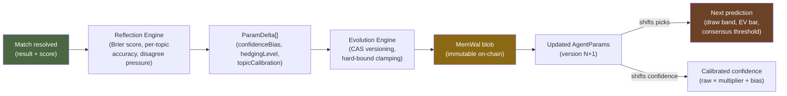
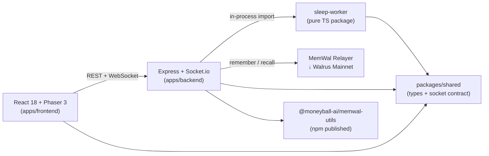

<!-- README.md | v3.1.0 | 2026-06-21 | last verified: feat/pre-submission-hardening @ 3686089 -->

<div align="center">

# 🕹️ Moneyball Cabinet

**Five AI agents with persistent, evolving memory predict FIFA World Cup 2026 — inside an cinematic 16-bit-inspired pixel-art arcade cabinet. Zero databases. All state lives on Walrus mainnet.**

[](https://github.com/anna-stolbovskaja/moneyball/actions/workflows/ci.yml)
[](https://www.npmjs.com/package/@moneyball-ai/memwal-utils)
[](https://www.npmjs.com/package/@moneyball-ai/memwal-utils)
[](https://taken-api.onrender.com/api/public/verifiability)
[](https://github.com/MystenLabs/MemWal)
[](https://walrus.xyz)
[](#tests)
[](LICENSE)

[Live Demo](https://taken.wal.app) · [Architecture](docs/ARCHITECTURE.md) · [Memory Design](docs/memory-design.md) · [API Reference](docs/api.md) · [Demo Script](docs/demo-script.md)

*Hackathon entry for [Walrus Memory World Cup](https://walrus.xyz) · Deadline: June 24, 2026*

</div>

---

## Why Moneyball Stands Out

> **Multi-agent memory evolution + zero-database architecture + published open-source SDK — all in one project.**

Most prediction apps wrap a single LLM in a chat interface. Moneyball is fundamentally different:

- 🧠 **5 specialized AI agents**, each with a unique mathematical model — not LLM wrappers, but deterministic prediction engines (Bayesian statistics, contrarian inversion, expected value, narrative sentiment, classical astrology)
- 📈 **Agents measurably evolve over time.** A sleep/evolve cycle computes Brier scores, per-topic calibration errors, and user disagreement pressure → parameter drift. Day 1 agents are provably different from Day 4+ agents. Every mutation is a Walrus blob.
- 🗄️ **Zero databases.** No PostgreSQL, no Redis, no Supabase, no IndexedDB. MemWal on Walrus mainnet is the *sole* persistent storage layer. The in-memory read-model rebuilds from MemWal on every cold boot.
- 📦 **Published npm SDK.** We extracted production-tested MemWal patterns into [`@moneyball-ai/memwal-utils`](https://www.npmjs.com/package/@moneyball-ai/memwal-utils) — a reusable open-source package for any builder working with MemWal.
- 🐛 **13 SDK issues filed** upstream on [MystenLabs/MemWal](https://github.com/MystenLabs/MemWal/issues) — bug reports, feature requests, and documentation gaps discovered during production use.
- 🕹️ **16-bit-inspired pixel-art arcade cabinet** built with Phaser 3 — interactive props (TV, coffee machine, flower), animated agent personas with thought bubbles, strict design system enforced by automated tests (no gradients, no rounded corners, pixel-perfect).
- 🎫 **Retro pixel ticket generator** — shareable 8-bit match tickets with predictions, agent weights, and Walrus blob IDs for social virality.
- 💾 **Crash-resilient write journal** — JSONL journal on disk ensures pending MemWal writes survive Render cold boots. No provenance gaps, even on ephemeral free-tier hosting.
- 🔒 **HMAC-signed guest identity** — prevents IDOR spoofing without requiring wallet connection.
- ✅ **562 automated tests** (356 FE + 206 BE) with CI design guards (`designDrift.test.ts` blocks emoji/gradients/border-radius; `contrastWcag.test.ts` enforces WCAG AA).

---

## Judging Criteria Map

| Criterion | How Moneyball Delivers | Evidence |
|-----------|------------------------|----------|
| **C1 · Memory Depth & Authenticity** | 5 agents run sleep/evolve cycles: Brier score + per-topic calibration → parameter drift. Day 1 ≠ Day 4. Every mutation is a Walrus blob with provenance badges (`[SEED]`/`[LIVE]`). User disagree history persists per Sui wallet. | [`docs/memory-design.md`](docs/memory-design.md) · [`GET /api/public/agents/:id/evolution`](docs/api.md) |
| **C2 · Creativity & Flair** | 16-bit-inspired pixel-art arcade cabinet (Phaser 3). 5 animated agent personas with thought bubbles. Interactive props. Retro pixel ticket generator for social sharing. Strict design system — no gradients, no rounded corners, pixel-perfect. | [`docs/design-spec.md`](docs/design-spec.md) · [`tokens.ts`](apps/frontend/src/styles/tokens.ts) · [`RetroTicket.tsx`](apps/frontend/src/components/RetroTicket.tsx) |
| **C3 · Technical Execution** | MemWal is the *sole* durable store — zero traditional databases. 562 automated tests. Deterministic evolution engine (no LLM in the prediction pipeline). Published npm SDK. HMAC-signed guest identity. Durable JSONL write journal survives cold boots. | [`packages/memwal-utils`](packages/memwal-utils/) · [CI pipeline](.github/workflows/ci.yml) · [`writeJournal.ts`](apps/backend/src/memory/writeJournal.ts) |

---

## How Walrus Memory Is Used

Moneyball uses [MemWal SDK](https://github.com/MystenLabs/MemWal) as its **only persistent storage layer**. Every agent prediction, parameter evolution, and user interaction flows through a rate-limited write queue to Walrus mainnet blobs. After matches resolve, a deterministic reflection engine computes calibration errors (Brier scores, per-topic accuracy, user disagreement pressure) and adjusts agent parameters — then persists the new version to MemWal. The result is a verifiable, append-only memory trail where every parameter change traces back to specific prediction outcomes stored on-chain.

### Memory Depth at a Glance

| Capability | Implementation |
|-----------|----------------|
| **Persistent predictions** | Match picks, confidence, reasoning, outcomes → MemWal blobs on Walrus mainnet. Clickable blob verification links in the UI. |
| **Sleep & evolve cycle** | Deterministic reflection engine (Brier score, per-topic accuracy, disagree pressure) → parameter calibration. Capped bounds prevent runaway drift. |
| **Auditable evolution** | Every parameter change links to specific prediction events. Timeline scrubber + before/after overlay in the Memory Moment UI. |
| **User memory** | Disagree history, interaction milestones persisted per Sui wallet. Agents roast returning users by memory. |
| **Provenance badges** | Every event in the UI is tagged `[SEED]` (baseline fixture) or `[LIVE]` (real MemWal write) — judges always know what's real. |
| **Zero-database architecture** | MemWal is the sole durable store. `MemWalWriteQueue` handles rate limits, coalescing, and exponential backoff. In-memory read-model rebuilds from MemWal on cold boot via `restore()`. |
| **Crash-resilient writes** | JSONL write journal on disk ensures pending MemWal writes survive Render cold boots — no provenance gaps. |

### Evolution Cycle (Day 1 ≠ Day N)



> **Memory affects behavior, not just logs.** Three agents (Dr. Morgan, Viktor Kane, Sofia Mendes) have their decision thresholds shifted by evolved parameters — a loss streak measurably changes future picks. Scout Alvarez and Madame Pythia are intentionally unaffected: the scout's gut and the oracle's stars don't recalibrate.

---

## Architecture

A pnpm monorepo with five packages:



| Package | Stack | Purpose |
|---------|-------|---------|
| `apps/frontend` | React 18, Phaser 3, Vite, Zustand, @mysten/dapp-kit | Pixel-art cabinet scene, HUD, agent modals, wallet connect |
| `apps/backend` | Express, Socket.io, MemWal SDK | REST API, WebSocket world, match pipeline, auth, memory |
| `sleep-worker` | Pure TypeScript | Reflection engine, evolution engine, param versioning |
| `packages/shared` | TypeScript | Typed socket events, shared schemas |
| `packages/memwal-utils` | TypeScript ([npm](https://www.npmjs.com/package/@moneyball-ai/memwal-utils)) | Rate-limited write queue, KV overlay, key builder |

Full C4 diagrams: **[docs/ARCHITECTURE.md](docs/ARCHITECTURE.md)**

---

## The Five Agents

Each agent uses a distinct, deterministic prediction model — no LLM calls in the pipeline. Agents marked with 🧬 have their picks shifted by memory evolution (T38):

| Agent | Methodology | Evolves picks? | Personality |
|-------|-------------|:--------------:|-------------|
| **Dr. Morgan** | Weighted metrics: teamStrength + homeAdvantage → margin → pick | 🧬 `hedgingLevel` widens draw band | Academic statistician. Trusts the numbers — but learns humility. |
| **Scout Alvarez** | Narrative sentiment: live team form (api-football) or matchday hash | — | Old-school scout. Gut feeling over spreadsheets. |
| **Viktor Kane** | Contrarian inversion: fades consensus when confidence is high | 🧬 `confidenceBias` shifts threshold | Provocateur. The more the crowd is wrong, the bolder he gets. |
| **Sofia Mendes** | Expected value: true probability vs. Bet365 odds → value bet | 🧬 `topicMultiplier` raises EV bar | Sharp bettor. Demands bigger edges on poorly-calibrated topics. |
| **Madame Pythia** | Deterministic mysticism: Pythagorean numerology + classical astrology | — | Enigmatic oracle. The stars are immutable. |

All five agents participate in a weighted consensus for each match. After match resolution, the sleep-worker runs the evolution engine: Brier score metrics + per-topic calibration errors → parameter deltas → new parameter version persisted to MemWal via CAS (compare-and-swap). For three agents, these evolved parameters feed back into the prediction engine — shifting borderline picks, not just confidence percentages.

---

## Data Sources & Model Transparency

Moneyball is **honest about what is real and what is synthetic.** Every model input declares its provenance via `GET /api/public/data-source`, surfaced in the UI so users and judges are never misled.

| Input | Source | Detail |
|-------|--------|--------|
| **Team strength** | Live | FIFA World Ranking mapped to [0.30, 0.70]. 48 WC2026 teams. |
| **Match schedule & results** | Live | [football-data.org](https://www.football-data.org/) v4 API, polled every 120s. |
| **Team form (narrative sentiment)** | Live | Last 5 match results from [api-football.com](https://www.api-football.com/). Fallback to matchday-salted hash. |
| **Bookmaker odds** | Live | 1X2 odds from Bet365 via [api-football.com](https://www.api-football.com/). Used by Sofia Mendes for EV calculation. Fallback to synthetic model. |
| **Home advantage** | Manual | Fixed +0.04 term. A hand-set constant, not measured. |

> `GET /api/public/data-source` reports provenance at runtime. Currently: *3 of 4 inputs use live data feeds.*

---

## Published SDK: @moneyball-ai/memwal-utils

[](https://www.npmjs.com/package/@moneyball-ai/memwal-utils)
[](https://www.npmjs.com/package/@moneyball-ai/memwal-utils)

We extracted the production-tested MemWal patterns from Moneyball into a reusable open-source package:

```bash
npm install @moneyball-ai/memwal-utils
```

```typescript
import { MemWalWriteQueue, KvOverlay, createKeyBuilder } from '@moneyball-ai/memwal-utils';

const queue = new MemWalWriteQueue(rememberFn);
queue.enqueue('prediction:match-1', JSON.stringify(data)); // non-blocking, coalesced
```

**What's inside:**
- **MemWalWriteQueue** — coalescing write queue with exponential backoff and 429-aware retry
- **KvOverlay** — key-value semantics (get/put/CAS) over MemWal's append-only store
- **createKeyBuilder** — type-safe key construction with namespace prefixes

Full documentation: [`packages/memwal-utils/README.md`](packages/memwal-utils/README.md)

---

## MemWal SDK Feedback

We filed **13 issues** on [MystenLabs/MemWal](https://github.com/MystenLabs/MemWal/issues) based on building Moneyball — covering missing features, SDK bugs, and documentation gaps:

| # | Issue | Author | Status |
|---|-------|--------|--------|
| [#312](https://github.com/MystenLabs/MemWal/issues/312) | `feat(sdk)`: semantic top-K | alexbelij | Open |
| [#311](https://github.com/MystenLabs/MemWal/issues/311) | `feat(sdk)`: surface blob\_id on recall() results | alexbelij | Open |
| [#298](https://github.com/MystenLabs/MemWal/issues/298) | `bug`: RecallManualResult union type mismatch | alexbelij | Open |
| [#297](https://github.com/MystenLabs/MemWal/issues/297) | `feat(sdk)`: TTL option for remember() | alexbelij | Open |
| [#296](https://github.com/MystenLabs/MemWal/issues/296) | `docs`: undocumented rate limits and quotas | anna-stolbovskaja | Open |
| [#295](https://github.com/MystenLabs/MemWal/issues/295) | `bug(sdk)`: SEAL SessionKey 5-min TTL silent failures | anna-stolbovskaja | Open |
| [#294](https://github.com/MystenLabs/MemWal/issues/294) | `feat(sdk)`: control analyze() fact extraction | anna-stolbovskaja | Open |
| [#293](https://github.com/MystenLabs/MemWal/issues/293) | `bug(sdk)`: recall() positional overload type error | anna-stolbovskaja | Open |
| [#292](https://github.com/MystenLabs/MemWal/issues/292) | `feat(sdk)`: structured metadata on remember() | anna-stolbovskaja | Open |
| [#291](https://github.com/MystenLabs/MemWal/issues/291) | `feat(sdk)`: cursor-based pagination for recall() | anna-stolbovskaja | Open |
| [#290](https://github.com/MystenLabs/MemWal/issues/290) | `feat(sdk)`: cursor-based pagination (duplicate) | anna-stolbovskaja | Closed |
| [#289](https://github.com/MystenLabs/MemWal/issues/289) | `feat(sdk)`: exact-match / key-based recall | anna-stolbovskaja | Open |
| [#288](https://github.com/MystenLabs/MemWal/issues/288) | `feat(sdk)`: exact-match recall (duplicate) | anna-stolbovskaja | Closed |

> See [`docs/walrus-memory-integration.md`](docs/walrus-memory-integration.md#11-lessons-learned--sdk-feedback) for the full lessons-learned reference with workarounds for each issue.

---

## Quickstart

> Last verified: `feat/pre-submission-hardening` @ `3686089` (2026-06-21)

### Prerequisites

- **Node.js** >= 18 (20+ recommended)
- **pnpm** >= 8

### Install & Run

```bash
git clone https://github.com/anna-stolbovskaja/moneyball.git
cd moneyball
pnpm install

cp apps/backend/.env.example apps/backend/.env
# Edit .env — at minimum set JWT_SECRET (>= 32 chars)

# Terminal 1 — backend
pnpm dev:backend
# → http://localhost:3001, prints "Server listening on port 3001"

# Terminal 2 — frontend
pnpm dev:frontend
# → http://localhost:5173
```

### Key Environment Variables

| Variable | Required | Purpose |
|----------|----------|---------|
| `JWT_SECRET` | Yes | Sign/verify JWTs (>= 32 chars) |
| `MEMWAL_KEY` | For MemWal | Ed25519 delegate key from [memory.walrus.xyz](https://memory.walrus.xyz) |
| `MEMWAL_ACCOUNT_ID` | For MemWal | Account ID on the MemWal relayer |
| `STORAGE_BACKEND` | No | `memwal` (default) or `file` for local dev |
| `FOOTBALL_DATA_TOKEN` | For live matches | [football-data.org](https://www.football-data.org/) v4 API key |

Full variable reference: [`apps/backend/.env.example`](apps/backend/.env.example)

### Typecheck

```bash
pnpm -r typecheck    # all 5 packages
```

### Tests

```bash
# Frontend — 356 tests
pnpm --filter @moneyball/frontend test

# Backend — 206 tests
pnpm --filter @moneyball/backend test

# Sleep-worker — regressions + simulation
pnpm -C sleep-worker exec tsx test/regressions.ts
pnpm -C sleep-worker exec tsx test/simulation.ts
```

---

## Deployment

| Component | Platform | URL |
|-----------|----------|-----|
| Frontend | Walrus Sites (mainnet) | [taken.wal.app](https://taken.wal.app) |
| Backend | Render (free tier) | `taken-api.onrender.com` |

Production deployment guide: **[docs/deploy.md](docs/deploy.md)**

---

## Demo

Step-by-step demo script covering the full match → predict → resolve → evolve cycle:

**[docs/demo-script.md](docs/demo-script.md)** (2:45 video script with preconditions and shot-by-shot breakdown)

---

## Project Structure

```
moneyball/
├── apps/
│   ├── frontend/                  # React 18 + Phaser 3 SPA
│   │   ├── src/components/        # AgentModal (7 tabs), RetroTicket, HUD
│   │   ├── src/phaser/            # Pixel-art cabinet scene, sprites
│   │   ├── src/styles/tokens.ts   # Design system — colors, fonts, spacing
│   │   ├── src/lib/               # journalEntries, explorer, formatDate
│   │   └── test/                  # 356 tests incl. designDrift + contrastWcag
│   └── backend/                   # Express + Socket.io server
│       ├── src/agents/            # AgentEventService, sleepService
│       ├── src/memory/            # MemWalWriteQueue, writeJournal, UserSummaryStore
│       ├── src/http/              # API routes, auth, rate limiting
│       └── test/                  # 206 tests
├── packages/
│   ├── shared/                    # Typed socket contract + schemas
│   └── memwal-utils/              # Published npm package (write queue, KV, keys)
├── sleep-worker/                  # Deterministic evolution engine
│   ├── src/reflection/            # Brier score metrics → ParamDelta[]
│   ├── src/evolution/             # CAS parameter versioning
│   └── src/sleep/                 # SleepWorker orchestrator
├── docs/                          # Architecture, memory design, API, deploy, demo
├── adr/                           # Architecture Decision Records
├── .github/workflows/ci.yml       # CI: typecheck + test + design guards
└── render.yaml                    # Render deploy blueprint
```

---

## Security

- **Guest identity:** HMAC-SHA256 signed tokens prevent IDOR (spoofing another user's guest ID)
- **Auth rate limiting:** Nonce and verify endpoints rate-limited by IP+address (429 on burst)
- **Wallet auth:** Sui personal message signature — no gas, no transaction, no private key exposure
- **No secrets in client:** All MemWal keys server-side only; frontend is a pure SPA
- **Dependency provenance:** `pnpm-lock.yaml` integrity hashes; no post-install scripts

---

## Contributing

1. Branch from `main` as `task/T<NN>-<slug>`
2. Run `pnpm -r typecheck && pnpm --filter @moneyball/frontend test && pnpm --filter @moneyball/backend test`
3. All colors/fonts must use `tokens.ts` — `designDrift.test.ts` blocks emoji, gradients, and border-radius
4. All text must pass WCAG AA contrast (>= 4.5:1) — `contrastWcag.test.ts` enforces this
5. Minimum font size: 14px (VT323 pixel font is unreadable below that)
6. No Cyrillic in UI strings — judges are English-speaking
7. PR to `main`

---

## License

MIT
