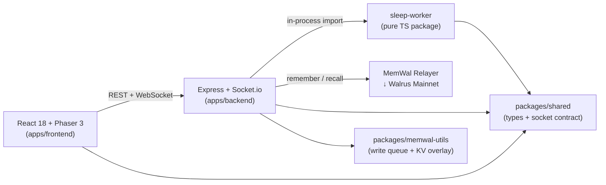

<!-- README.md | v1.0.0 | 2026-06-12 -->

<div align="center">

# 🕹️ Moneyball Cabinet

**Five AI agents with persistent memory predict FIFA World Cup 2026 — inside an SNES-style pixel-art arcade cabinet.**

[](https://github.com/anna-stolbovskaja/moneyball/actions/workflows/ci.yml)

<!-- TODO: add screenshot at docs/assets/hero.png, then uncomment:

-->

*Hackathon entry for [Walrus Memory World Cup](https://walrus.xyz) · Deadline: June 24, 2026*

</div>

---

## Why Memory Depth

> **Memory Depth & Authenticity** is the #1 judging criterion. Here's how Moneyball delivers it.

- **Agents remember every prediction** — match picks, confidence levels, reasoning and outcomes are persisted to [MemWal](https://github.com/mysten-incubation/memwal) on Walrus mainnet. Nothing is ephemeral.
- **Agents sleep and evolve** — after enough outcomes resolve, a deterministic sleep cycle computes calibration metrics (Brier score, per-topic accuracy, user disagree pressure) and adjusts agent parameters. Day 1 agents are measurably different from day 4+ agents.
- **Evolution is auditable** — every parameter change traces to specific prediction events with computed metrics. Judges can verify the full chain via `GET /api/public/agents/:agentId/evolution`.
- **Users are remembered too** — each visitor's disagree history and interaction milestones are persisted on MemWal. Agents roast returning users based on their stored profile.
- **MemWal is the ONLY storage** — no database, no Redis. All durable state lives on Walrus mainnet through the MemWal relayer. Local filesystem is a dev-only fallback.

📖 Full technical deep-dive: **[docs/memory-design.md](docs/memory-design.md)**

---

## Architecture

A pnpm monorepo with five packages:



| Package | Stack | Purpose |
|---------|-------|---------|
| `apps/frontend` | React 18, Phaser 3, Vite, Zustand, @mysten/dapp-kit | Pixel-art cabinet scene, HUD, agent modals, wallet connect |
| `apps/backend` | Express, Socket.io, MemWal SDK | REST API, WebSocket world, match pipeline, auth, memory |
| `sleep-worker` | Pure TypeScript | Reflection engine, evolution engine, param versioning |
| `packages/shared` | TypeScript | Typed socket events, shared schemas |
| `packages/memwal-utils` | TypeScript | Rate-limited write queue, KV overlay, key builder for MemWal SDK ([README](packages/memwal-utils/README.md)) |

📖 Full C4 diagrams: **[docs/ARCHITECTURE.md](docs/ARCHITECTURE.md)**

---

## Quickstart

### Prerequisites

- **Node.js** ≥ 18 (20 recommended)
- **pnpm** ≥ 8

### Install

```bash
git clone https://github.com/anna-stolbovskaja/moneyball.git
cd moneyball
pnpm install
```

### Configure

```bash
cp apps/backend/.env.example apps/backend/.env
```

Edit `apps/backend/.env` — at minimum set:

| Variable | Required | Description |
|----------|----------|-------------|
| `JWT_SECRET` | Yes | ≥ 32 chars, used to sign/verify JWTs |
| `MEMWAL_KEY` | For MemWal | API key from [memory.walrus.xyz](https://memory.walrus.xyz) |
| `MEMWAL_ACCOUNT_ID` | For MemWal | Account ID |
| `STORAGE_BACKEND` | No | `memwal` (default) or `file` for local dev |

See [`apps/backend/.env.example`](apps/backend/.env.example) for all options.

### Run (development)

```bash
# Terminal 1 — backend
pnpm dev:backend

# Terminal 2 — frontend
pnpm dev:frontend
```

Frontend opens at `http://localhost:5173`. Backend serves at `http://localhost:3001`.

### Typecheck

```bash
pnpm typecheck          # all packages
```

### Tests

```bash
# Frontend (vitest)
pnpm -C apps/frontend test

# Backend (vitest)
pnpm -C apps/backend test

# Backend under bun (optional — same suite via bun-test-runner shim)
pnpm -C apps/backend test:bun

# Sleep-worker (regressions + simulation)
pnpm -C sleep-worker exec tsx test/regressions.ts
pnpm -C sleep-worker exec tsx test/simulation.ts
```

---

## Demo

A step-by-step demo script covering the full match → predict → resolve →
evolve cycle:

📖 **[docs/demo-script.md](docs/demo-script.md)**

<!-- Replace with actual video link when recorded -->
🎬 *Demo video: coming soon*

---

## Deployment

Production deployment guide (Render backend + Walrus Sites frontend):

📖 **[docs/deploy.md](docs/deploy.md)**

---

## Judging Criteria Map

| Criterion | Weight | Where to Look |
|-----------|--------|---------------|
| **Memory Depth & Authenticity** | #1 | [`docs/memory-design.md`](docs/memory-design.md) — full memory architecture. Live: `GET /api/public/agents/:agentId/evolution` shows real parameter changes over time. `GET /api/public/agents/:agentId/params` shows current calibrated state. |
| **Creativity & Flair** | #2 | SNES pixel-art cabinet with 5 AI agent personas. Thought bubbles, disagree/roast loop, interactive objects. See `docs/reference/` for pixel art assets. |
| **Technical Execution (Walrus Mainnet)** | #3 | MemWal relayer config in `.env.example`. `MEMWAL_RELAYER=https://relayer.memory.walrus.xyz`. All writes go through `MemWalWriteQueue` → relayer → Walrus mainnet blobs. Zero other databases. |

---

## Project Structure

```
moneyball/
├── apps/
│   ├── frontend/          # React + Phaser SPA
│   └── backend/           # Express + Socket.io server
├── packages/
│   ├── shared/            # Typed socket contract + schemas
│   └── memwal-utils/      # Write queue, KV overlay, key builder (publishable)
├── sleep-worker/          # Deterministic evolution engine
├── docs/
│   ├── ARCHITECTURE.md    # C4 diagrams
│   ├── api.md             # REST + Socket.io reference
│   ├── memory-design.md   # Memory architecture (this project's core)
│   ├── deploy.md          # Production deployment
│   ├── demo-script.md     # Step-by-step demo
│   └── reference/         # Pixel art assets
├── .github/workflows/     # CI (typecheck + vitest + sleep-worker tests)
└── render.yaml            # Render deploy blueprint
```

---

## API Reference

📖 **[docs/api.md](docs/api.md)** — complete REST + Socket.io reference.

Five agents: `dr_morgan` · `scout_alvarez` · `viktor_kane` · `sofia_mendes` · `madame_pythia`

---

## License

TBD
