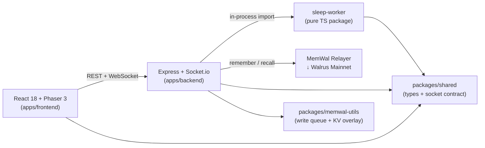

<!-- README.md | v2.0.0 | 2026-06-17 -->

<div align="center">

# 🕹️ Moneyball Cabinet

**Five AI agents with persistent memory predict FIFA World Cup 2026 — inside an SNES-style pixel-art arcade cabinet.**

[](https://github.com/anna-stolbovskaja/moneyball/actions/workflows/ci.yml)

<!-- TODO: add screenshot at docs/assets/hero.png, then uncomment:

-->

[Live Demo](https://taken.wal.app) · [Architecture](docs/ARCHITECTURE.md) · [API Reference](docs/api.md) · [Memory Design](docs/memory-design.md)

*Hackathon entry for [Walrus Memory World Cup](https://walrus.xyz) · Deadline: June 24, 2026*

</div>

---

## How Walrus Memory Is Used

Moneyball uses [Walrus Memory (MemWal)](https://github.com/MystenLabs/MemWal) as its **only persistent storage layer** — no PostgreSQL, no Redis, no S3. Every agent prediction, every parameter evolution, every user interaction is written to Walrus mainnet through the MemWal SDK relayer. Five AI agents run continuous sleep/evolve cycles: after matches resolve, a deterministic reflection engine computes calibration errors (Brier scores, per-topic accuracy, user disagreement pressure) and adjusts agent parameters — then persists the new version to MemWal. The result is a verifiable, append-only memory trail where Day 1 agents are measurably different from Day 4+ agents, and every parameter change traces back to specific prediction outcomes stored on-chain.

---

## Why Memory Depth

> **Memory Depth & Authenticity** is the #1 judging criterion. Here's how Moneyball delivers it.

| Capability | How It Works |
|-----------|-------------|
| **Persistent predictions** | Match picks, confidence levels, reasoning, and outcomes → MemWal on Walrus mainnet. Nothing is ephemeral. |
| **Sleep & evolve cycle** | Deterministic reflection engine (Brier score, per-topic accuracy, disagree pressure) → parameter calibration. Day 1 ≠ Day 4. |
| **Auditable evolution** | Every parameter change traces to specific prediction events with computed metrics. Verify: `GET /api/public/agents/:agentId/evolution`. |
| **User memory** | Disagree history, interaction milestones persisted per Sui wallet. Agents roast returning users by memory. |
| **Zero-database architecture** | MemWal is the sole durable store. `MemWalWriteQueue` handles rate limits and retry. In-memory read-model rebuilds from MemWal on cold boot. |

📖 **[docs/memory-design.md](docs/memory-design.md)** — full memory architecture
📖 **[docs/walrus-memory-integration.md](docs/walrus-memory-integration.md)** — MemWal SDK integration reference (write queue, read-model, KV overlay, boot hydration, rate limiting, lessons learned)

---

## Architecture

A pnpm monorepo with five packages:



| Package | Stack | Purpose |
|---------|-------|---------|
| `apps/frontend` | React 18, Phaser 3, Vite, Zustand, @mysten/dapp-kit | Pixel-art cabinet scene, HUD, agent modals, wallet connect |
| `apps/backend` | Express, Socket.io, MemWal SDK | REST API, WebSocket world, match pipeline, auth, memory |
| `sleep-worker` | Pure TypeScript | Reflection engine, evolution engine, param versioning |
| `packages/shared` | TypeScript | Typed socket events, shared schemas |
| `packages/memwal-utils` | TypeScript | Rate-limited write queue, KV overlay, key builder for MemWal SDK ([README](packages/memwal-utils/README.md)) |

📖 Full C4 diagrams: **[docs/ARCHITECTURE.md](docs/ARCHITECTURE.md)**

---

## Walrus Memory Integration

Moneyball's memory layer consists of three reusable modules:

### MemWalWriteQueue

**File:** [`apps/backend/src/memory/memwalWriteQueue.ts`](apps/backend/src/memory/memwalWriteQueue.ts)

A production-grade write queue for the MemWal SDK that handles rate limiting, key-based coalescing, and exponential backoff:

```typescript
import { MemWalWriteQueue } from './memory/memwalWriteQueue';

const queue = new MemWalWriteQueue(
  (text) => memwal.remember(text),
  { debounceMs: 1500, minIntervalMs: 1200 }
);

// Non-blocking — coalesces rapid writes to the same key
queue.enqueue('params:dr_morgan', JSON.stringify(params));
```

**Key features:**
- Key-based coalescing (last-writer-wins within debounce window)
- Parses `retry_after_seconds` from 429 responses
- Exponential backoff capped at 60s
- Non-blocking enqueue — background processing loop

### MemWalUserSummaryStore

**File:** [`apps/backend/src/memory/memwalUserSummaryStore.ts`](apps/backend/src/memory/memwalUserSummaryStore.ts)

Persistent user profile storage on MemWal with local caching and write coalescing:

```typescript
import { MemWalUserSummaryStore } from './memory/memwalUserSummaryStore';

const store = new MemWalUserSummaryStore();
const summary = await store.get(walletAddress);  // cached for 30s
await store.put(walletAddress, updatedSummary);   // coalesced write
```

**Key features:**
- 30-second local cache TTL
- Write coalescing via `MemWalWriteQueue`
- Graceful fallback to `FileUserSummaryStore` for local development

### StoreFactory

**File:** [`apps/backend/src/memory/storeFactory.ts`](apps/backend/src/memory/storeFactory.ts)

Selects the storage backend based on environment configuration:

```typescript
import { getUserSummaryStore } from './memory/storeFactory';

const store = getUserSummaryStore(); // MemWal in production, file in dev
```

📖 **[docs/walrus-memory-integration.md](docs/walrus-memory-integration.md)** — complete integration reference with namespace strategy, boot hydration, sleep-worker adapters, and lessons learned.

---

## Quickstart

### Prerequisites

- **Node.js** ≥ 18 (20 recommended)
- **pnpm** ≥ 8

### Install

```bash
git clone https://github.com/anna-stolbovskaja/moneyball.git
cd moneyball
pnpm install
```

### Configure

```bash
cp apps/backend/.env.example apps/backend/.env
```

Edit `apps/backend/.env` — at minimum set:

| Variable | Required | Description |
|----------|----------|-------------|
| `JWT_SECRET` | Yes | ≥ 32 chars, used to sign/verify JWTs |
| `MEMWAL_KEY` | For MemWal | Ed25519 delegate key from [memory.walrus.xyz](https://memory.walrus.xyz) |
| `MEMWAL_ACCOUNT_ID` | For MemWal | Account ID on the MemWal relayer |
| `MEMWAL_RELAYER` | For MemWal | `https://relayer.memwal.ai` |
| `MEMWAL_NAMESPACE` | For MemWal | Namespace for all writes (e.g. `moneyball:prod`) |
| `STORAGE_BACKEND` | No | `memwal` (default) or `file` for local dev |
| `FOOTBALL_DATA_TOKEN` | For live matches | [football-data.org](https://www.football-data.org/) v4 API key |
| `API_FOOTBALL_KEY` | For odds/form | [api-football.com](https://www.api-football.com/) key |
| `RAPIDAPI_KEY` | Fallback | RapidAPI key (fallback for api-football) |

See [`apps/backend/.env.example`](apps/backend/.env.example) for all options.

### Run (development)

```bash
# Terminal 1 — backend
pnpm dev:backend

# Terminal 2 — frontend
pnpm dev:frontend
```

Frontend opens at `http://localhost:5173`. Backend serves at `http://localhost:3001`.

### Typecheck

```bash
pnpm typecheck          # all packages
```

### Tests

```bash
# Frontend (vitest) — 226+ tests
pnpm -C apps/frontend test

# Backend (vitest) — 132+ tests
pnpm -C apps/backend test

# Sleep-worker (regressions + simulation)
pnpm -C sleep-worker exec tsx test/regressions.ts
pnpm -C sleep-worker exec tsx test/simulation.ts
```

---

## Demo

A step-by-step demo script covering the full match → predict → resolve →
evolve cycle:

📖 **[docs/demo-script.md](docs/demo-script.md)**

<!-- Replace with actual video link when recorded -->
🎬 *Demo video: coming soon*

---

## Deployment

| Component | Platform | URL |
|-----------|----------|-----|
| Frontend | Walrus Sites (mainnet) | [taken.wal.app](https://taken.wal.app) |
| Backend | Render (free tier) | `taken-api.onrender.com` |

📖 **[docs/deploy.md](docs/deploy.md)** — production deployment guide

---

## Judging Criteria Map

| Criterion | Weight | Where to Look |
|-----------|--------|---------------|
| **Memory Depth & Authenticity** | #1 | [`docs/memory-design.md`](docs/memory-design.md) — full memory architecture. [`docs/walrus-memory-integration.md`](docs/walrus-memory-integration.md) — SDK integration patterns. Live: `GET /api/public/agents/:agentId/evolution` shows real parameter changes over time. |
| **Creativity & Flair** | #2 | SNES pixel-art cabinet with 5 AI agent personas. Thought bubbles, disagree/roast loop, Memory Moment UI (journal, timeline scrubber, before/after overlay). PWA installable. |
| **Technical Execution (Walrus Mainnet)** | #3 | All writes → `MemWalWriteQueue` → MemWal relayer → Walrus mainnet blobs. Zero external databases. 358+ tests (226 FE + 132 BE). Deterministic evolution engine — no LLM in the prediction pipeline. |

---

## Project Structure

```
moneyball/
├── apps/
│   ├── frontend/                      # React + Phaser SPA
│   │   ├── src/components/            # AgentModal (7 tabs), HUD, StatsBoard
│   │   ├── src/phaser/                # Pixel-art cabinet scene, sprites
│   │   ├── src/styles/tokens.ts       # Single source of truth — colors, fonts
│   │   └── src/lib/                   # formatDate, beforeAfterDiff
│   └── backend/                       # Express + Socket.io server
│       ├── src/agents/                # AgentEventService, sleepService
│       ├── src/memory/                # MemWalWriteQueue, UserSummaryStore
│       └── src/http/                  # API routes
├── packages/
│   ├── shared/            # Typed socket contract + schemas
│   └── memwal-utils/      # Write queue, KV overlay, key builder (publishable)
├── sleep-worker/          # Deterministic evolution engine
│   └── shared/                        # Typed socket contract + schemas
├── sleep-worker/                      # Deterministic evolution engine
│   ├── src/reflection/                # Brier score metrics → ParamDelta[]
│   ├── src/evolution/                 # CAS parameter versioning
│   └── src/sleep/                     # SleepWorker orchestrator
├── docs/
│   ├── ARCHITECTURE.md                # C4 diagrams
│   ├── walrus-memory-integration.md   # MemWal SDK integration reference
│   ├── memory-design.md               # Memory architecture deep-dive
│   ├── api.md                         # REST + Socket.io reference
│   ├── deploy.md                      # Production deployment
│   └── demo-script.md                 # Step-by-step demo
├── scripts/
│   └── seed-demo.ts                   # Idempotent seeder (8 matches, 5 agents)
├── .github/workflows/                 # CI pipeline
└── render.yaml                        # Render deploy blueprint
```

---

## API Reference

📖 **[docs/api.md](docs/api.md)** — complete REST + Socket.io reference.

Five agents: `dr_morgan` · `scout_alvarez` · `viktor_kane` · `sofia_mendes` · `madame_pythia`

---

## Data Sources & Model Transparency

Moneyball is **honest about what is real and what is synthetic.** Every model input declares its provenance via `GET /api/public/data-source`, surfaced in the UI so users and judges are never misled.

| Input | Source | Detail |
|-------|--------|--------|
| **Team strength** | 🟢 Live | FIFA World Ranking (June 2025) mapped to [0.30, 0.70]. 48 WC2026 teams. |
| **Match schedule & results** | 🟢 Live | [football-data.org](https://www.football-data.org/) v4 API, competition WC. Polled every 120s. |
| **Home advantage** | 🟡 Manual | Fixed +0.04 term. A hand-set constant, not measured. |
| **Narrative sentiment** | 🔴 Synthetic | Matchday-salted hash. Not sourced from news or social feeds. |
| **Bookmaker odds** | 🔴 Synthetic | Derived from team strength + noise. No live odds feed connected. |

> `MODEL_INPUTS_VERSION` in `dataSource.ts` is bumped whenever a synthetic input goes live.

### The Agents

| Agent | Methodology | Key input |
|-------|-------------|-----------|
| **Dr. Morgan** | Weighted metrics | teamStrength + homeAdvantage → margin → pick |
| **Scout Alvarez** | Narrative sentiment | "Gut feeling" — matchday-salted signal |
| **Viktor Kane** | Contrarian inversion | Fades Dr. Morgan's consensus when confidence is high |
| **Sofia Mendes** | Expected value | Compares true probability vs. market odds → value bet |
| **Madame Pythia** | Deterministic mysticism | Numerology + classical astrology (no external data) |

### Published SDK

The MemWal utility layer is published as [`@moneyball-ai/memwal-utils`](https://www.npmjs.com/package/@moneyball-ai/memwal-utils) — write queue, KV overlay, and key builder for MemWal SDK integration.
## MemWal SDK Feedback
We filed 13 issues on [MystenLabs/MemWal](https://github.com/MystenLabs/MemWal/issues) based on building Moneyball — covering missing features, SDK bugs, and documentation gaps. See [docs/walrus-memory-integration.md § Lessons Learned](docs/walrus-memory-integration.md#11-lessons-learned--sdk-feedback) for the full list.
---
## Contributing
1. Branch from `main` as `task/T<NN>-<slug>`
2. Run `pnpm typecheck && pnpm -C apps/frontend test && pnpm -C apps/backend test`
3. Ensure no raw hex colors in components (use `tokens.ts`) — `designDrift.test.ts` enforces this
4. Ensure WCAG AA contrast compliance — `contrastGuard.test.ts` enforces this
5. No Cyrillic in UI strings — judges are English-speaking
6. PR to `main`

---

## License

TBD
