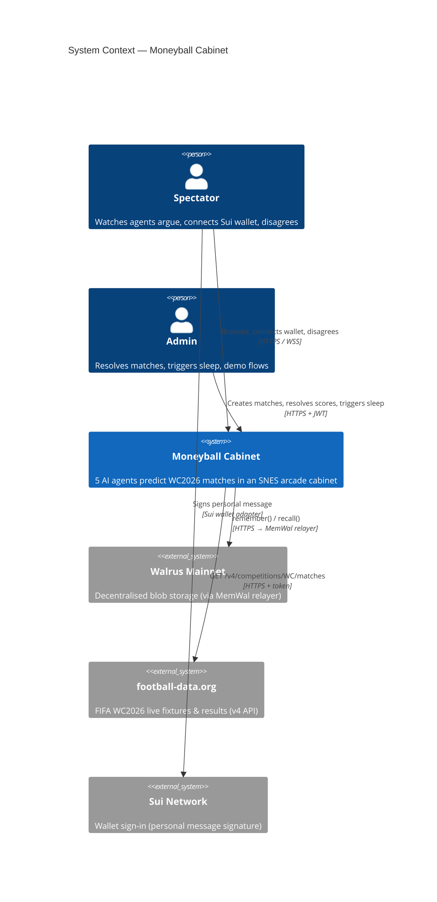
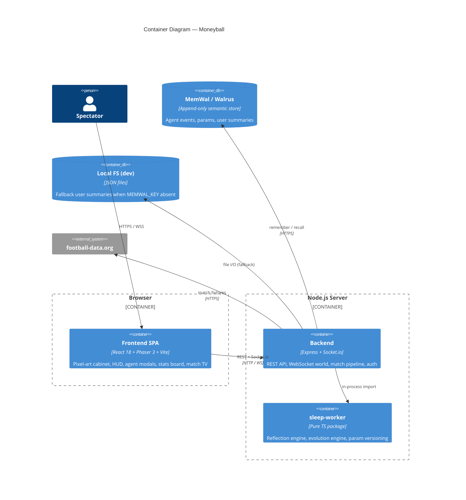
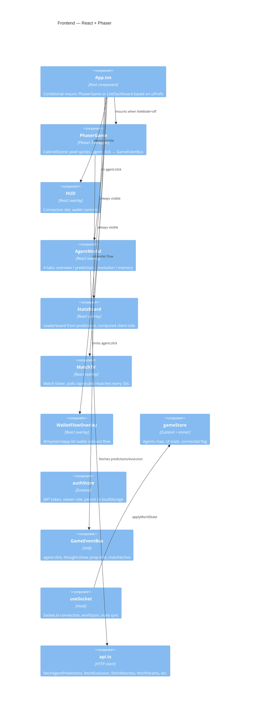
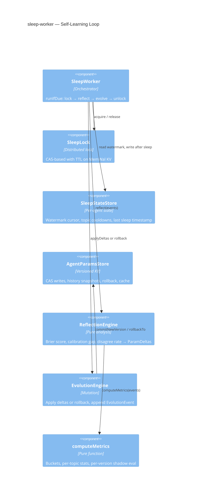
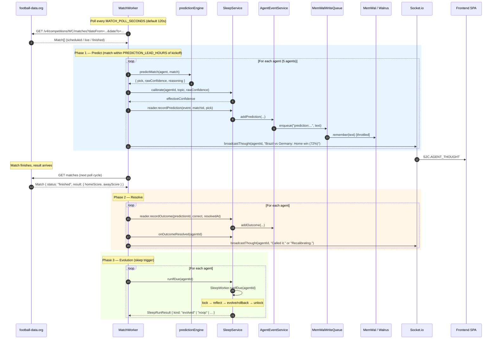
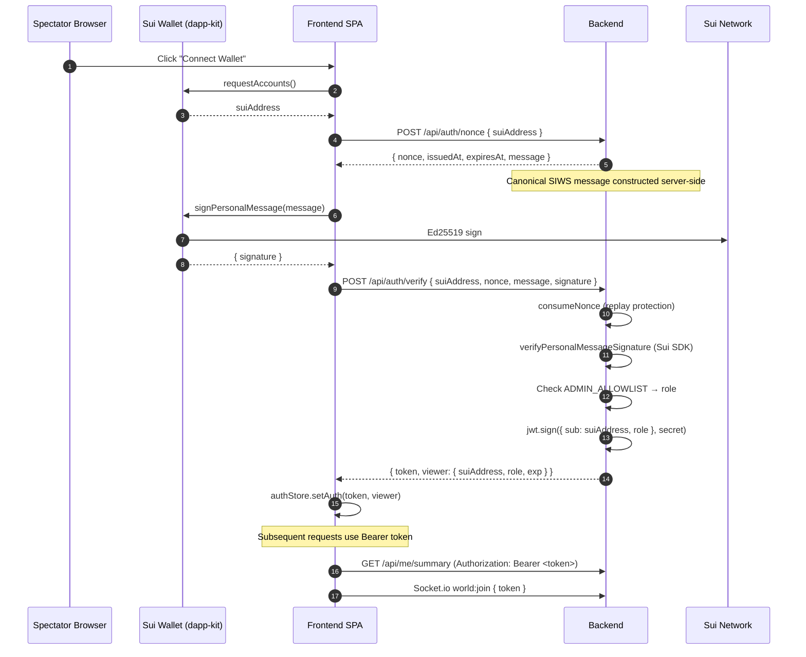
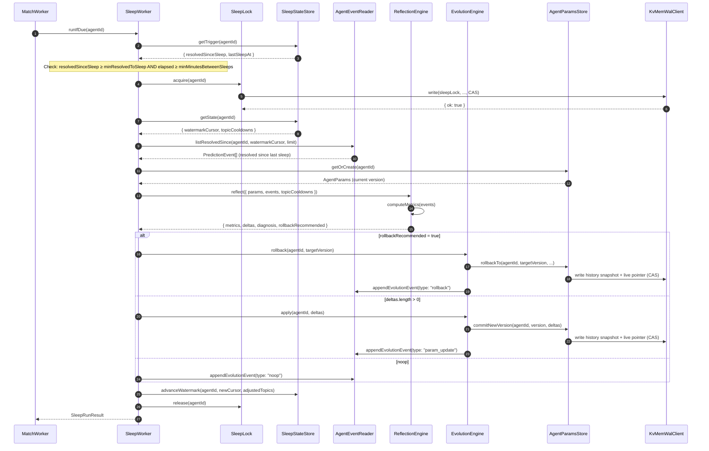
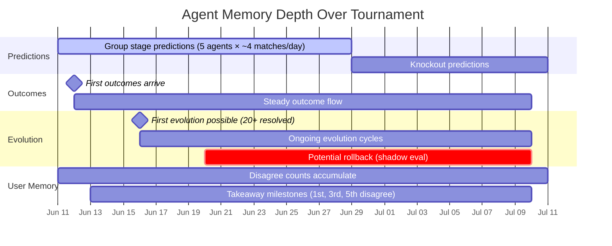

<!-- ARCHITECTURE.md | v1.0.0 | 2026-06-12 -->

# Moneyball — Architecture Guide

> SNES-style pixel-art arcade cabinet where five AI agents predict FIFA World Cup 2026 matches.
> Memory persists on [MemWal](https://github.com/mysten-incubation/memwal) / Walrus mainnet.
> Hackathon entry for **Walrus Memory World Cup**.

---

## Table of Contents

1. [System Context (C4 Level 1)](#1-system-context)
2. [Container Diagram (C4 Level 2)](#2-container-diagram)
3. [Component Diagrams (C4 Level 3)](#3-component-diagrams)
4. [Data Flow — Match Lifecycle](#4-data-flow--match-lifecycle)
5. [Data Flow — Authentication](#5-data-flow--authentication)
6. [Data Flow — Sleep / Evolution Pipeline](#6-data-flow--sleep--evolution-pipeline)
7. [Module Map](#7-module-map)
8. [Key Decisions](#8-key-decisions)
9. [Non-Goals & Constraints](#9-non-goals--constraints)

---

## 1. System Context

---

## 2. Container Diagram

---

## 3. Component Diagrams

### 3a. Frontend Components

### 3b. Backend Components

```mermaid
C4Component
  title Backend — Express + Socket.io

  Component(index, "index.ts", "Entrypoint", "Wires Express, Socket.io, MatchWorker, SleepService")

  Component(authRoutes, "authRoutes", "Express router", "POST /api/auth/nonce, POST /api/auth/verify")
  Component(apiRoutes, "apiRoutes", "Express router", "GET /api/me/summary, POST /api/me/disagree, POST /api/roast")
  Component(agentEventRoutes, "agentEventRoutes", "Express router", "GET predictions/evolution, POST admin predict/evolve")
  Component(matchRoutes, "matchRoutes", "Express router", "GET /api/public/matches, POST admin match CRUD, POST sleep trigger")
  Component(adminRoutes, "adminRoutes", "Express router", "POST /api/admin/simulate/day-plus-one")

  Component(registerSocket, "registerSocket", "Socket.io handler", "world:join, world:state broadcast, agent:thought broadcast")
  Component(worldState, "InMemoryWorldStateStore", "State", "Agents array, tick counter, connected clients set")

  Component(matchWorker, "MatchWorker", "Polling loop", "Fetches fixtures → predict → resolve → sleep trigger")
  Component(predEngine, "predictionEngine", "Pure functions", "5 deterministic methodologies, zero-LLM")
  Component(mysticEngine, "mysticismEngine", "Pure functions", "Numerology + astrology books for Madame Pythia")
  Component(footballProvider, "FootballDataProvider", "MatchProvider", "football-data.org v4 adapter")
  Component(manualProvider, "ManualMatchProvider", "MatchProvider", "Admin-fed in-memory matches")

  Component(agentEventSvc, "AgentEventService", "MemWal store", "Predictions, outcomes, evolution events per agent namespace")
  Component(sleepService, "SleepService", "Composition root", "Wires sleep-worker with MemWal adapters")
  Component(sleepAdapters, "KvMemWalClient + BackendEventReader", "Adapters", "In-process KV with MemWal mirror; event reader with public event sync")
  Component(writeQueue, "MemWalWriteQueue", "Throttle", "Debounce + rate-limit for remember() calls, exponential backoff on 429")

  Component(userSummaryStore, "UserSummaryStore", "Storage", "File or MemWal backend, factory pattern")

  Rel(index, matchWorker, "starts polling")
  Rel(matchWorker, predEngine, "predictMatch()")
  Rel(matchWorker, sleepService, "calibrate, onOutcomeResolved, runIfDue")
  Rel(sleepService, sleepAdapters, "delegates to KV + event reader")
  Rel(sleepAdapters, agentEventSvc, "mirrors events for public endpoints")
  Rel(agentEventSvc, writeQueue, "coalesced MemWal writes")
  Rel(predEngine, mysticEngine, "divine() for Madame Pythia")
```

### 3c. Sleep-Worker Package

---

## 4. Data Flow — Match Lifecycle

---

## 5. Data Flow — Authentication

---

## 6. Data Flow — Sleep / Evolution Pipeline

---

## 7. Module Map

### Frontend (`apps/frontend/src/`)

| Module | Purpose |
|---|---|
| `App.tsx` | Root: mounts Phaser or LiteDashboard, overlays HUD/Modal/Stats/MatchTV/Wallet |
| `phaser/PhaserGame.tsx` | Creates Phaser instance, sleeps during wallet flow |
| `phaser/scenes/CabinetScene.ts` | Pixel-art scene: agents, props, click handlers |
| `components/HUD.tsx` | Connection indicator + WalletControls |
| `components/AgentModal.tsx` | 4-tab modal: overview / predictions / evolution / memory |
| `components/StatsBoard.tsx` | Leaderboard (computed from predictions client-side) |
| `components/MatchTV.tsx` | TV ticker polling `/api/public/matches` |
| `components/WalletControls.tsx` | Sui wallet connect / disconnect / switch |
| `components/WalletFlowOverlay.tsx` | Full-screen wallet flow (dapp-kit) |
| `store/gameStore.ts` | Zustand (immer): agents, UI flags, connected state |
| `store/authStore.ts` | Zustand: JWT persistence, viewer role |
| `hooks/useSocket.ts` | Socket.io connection, world:join, state/thought sync |
| `events/GameEventBus.ts` | mitt event bus: agent:click, thought:show, prop:click |
| `lib/api.ts` | HTTP client: all backend API functions |
| `lib/config.ts` | Env config (VITE_BACKEND_URL, etc.) |
| `lib/guest.ts` | Guest ID via localStorage (crypto.randomUUID) |

### Backend (`apps/backend/src/`)

| Module | Purpose |
|---|---|
| `index.ts` | Entrypoint: Express + Socket.io + MatchWorker + SleepService |
| `config/env.ts` | Environment variables with defaults |
| `http/authRoutes.ts` | Sui SIWS auth: nonce issuance + signature verification + JWT |
| `http/jwtMiddleware.ts` | Optional JWT parsing + admin enforcement |
| `http/apiRoutes.ts` | User API: summary, disagree, roast |
| `http/agentEventRoutes.ts` | Public read + admin write for predictions/evolution |
| `http/matchRoutes.ts` | Public match feed + admin match CRUD + sleep trigger |
| `http/adminRoutes.ts` | Admin simulate day-plus-one |
| `realtime/registerSocket.ts` | Socket.io: world:join with JWT, state broadcast, thought broadcast |
| `realtime/worldStateStore.ts` | In-memory world state: agents, ticks, clients |
| `agents/agentEventService.ts` | MemWal store for predictions/outcomes/evolution events |
| `agents/sleepService.ts` | Composition root wiring sleep-worker to MemWal adapters |
| `agents/sleepAdapters.ts` | KvMemWalClient + BackendEventReader (sleep-worker ports) |
| `agents/agent-config.v1.json` | 5-agent config: id, name, methodology type, parameters |
| `matches/matchWorker.ts` | Polling loop: fetch → predict → resolve → evolve |
| `matches/predictionEngine.ts` | 5 deterministic methodologies (zero-LLM) |
| `matches/types.ts` | Match, PickCode, MatchProvider interface |
| `matches/footballDataProvider.ts` | football-data.org v4 adapter |
| `matches/manualProvider.ts` | Admin-fed in-memory match provider |
| `matches/mysticism/mysticismEngine.ts` | Pythagorean numerology + classical astrology |
| `matches/mysticism/numerology.v1.json` | Letter values, master numbers, planet friendships |
| `matches/mysticism/astrology.v1.json` | Zodiac dates, element affinities, day rulers |
| `memory/userSummaryStore.ts` | File-based user summary store |
| `memory/memwalUserSummaryStore.ts` | MemWal-backed user summary store with cache |
| `memory/memwalWriteQueue.ts` | Throttled/coalesced MemWal writes with backoff |
| `memory/storeFactory.ts` | Factory: MemWal or file-based user summary store |
| `util/rateLimit.ts` | Simple per-key rate limiter (thought broadcast) |

### Shared (`packages/shared/src/`)

| Module | Purpose |
|---|---|
| `events/types.ts` | WorldAgentState, WorldStatePayload, AgentThoughtPayload, etc. |
| `events/names.ts` | C2S / S2C event name constants |
| `events/socket-io.ts` | Typed Socket.io interfaces |
| `digitalClock.ts` | Shared clock utility |

### Sleep-Worker (`sleep-worker/src/`)

| Module | Purpose |
|---|---|
| `index.ts` | Public API + `createSleepWorker()` composition root |
| `memory/keys.ts` | MemWal key layout (single source of truth) |
| `memory/MemWalClient.ts` | Port interface for KV operations + Clock |
| `params/AgentParams.ts` | AgentParams type, bounds, calibration, ParamDelta |
| `params/AgentParamsStore.ts` | Versioned store: CAS writes, history, rollback |
| `events/types.ts` | PredictionEvent, EvolutionEvent, AgentEventReader port |
| `reflection/metrics.ts` | computeMetrics(): Brier, calibration, per-topic, per-version |
| `reflection/ReflectionEngine.ts` | Deterministic reflection: events → ParamDeltas + rollback rec |
| `evolution/EvolutionEngine.ts` | Apply deltas or rollback, append evolution event |
| `sleep/SleepWorker.ts` | Orchestrator: lock → reflect → evolve → unlock |
| `sleep/SleepState.ts` | SleepState type (watermark, cooldowns) |
| `sleep/SleepStateStore.ts` | Persistence for sleep state |
| `sleep/SleepLock.ts` | CAS-based distributed lock with TTL |

---

## 8. Key Decisions

| # | Decision | Rationale |
|---|---|---|
| D1 | MemWal is the ONLY durable storage | Hackathon rule: memory on Walrus mainnet. File storage is dev fallback only. |
| D2 | Zero-LLM predictions | Deterministic engines ensure same (agent, match) → same pick forever. Learning lives in `AgentParams`, not in prompts. |
| D3 | Single backend instance = single writer | CAS on in-process Map is sound. MemWal mirror is the durable trail; in-process state is authoritative. |
| D4 | Latest pointers off-chain, durable record in MemWal | Restart hydration is best-effort via recall. MVP risk documented; V2 = Quilt KV manifest. |
| D5 | Sleep pipeline is event-driven, not cron | `runIfDue` is called after match resolutions. Trigger threshold: `minResolvedToSleep` outcomes since last sleep. |
| D6 | Signal separation | Outcomes → calibration (confidenceBias, topicMultiplier). Disagrees → hedgingLevel ONLY. A disagree is not an error. |
| D7 | History-before-pointer invariant | Every params commit snapshots to history BEFORE switching the live pointer. Crash between writes → no orphan reference. |
| D8 | Props system untouchable | `props.json`, `props_manifest.json`, and `public/assets/**` are designer-owned. Code must not modify them. |

---

## 9. Agent Memory — Day 1 vs Day 4+ (Judging Criterion #1)

> **Memory Depth** is the #1 judging criterion. This section explains exactly what
> gets written to Walrus, when, and how the agent's personality measurably deepens
> over time.

### What is written

Every agent event is persisted to Walrus mainnet via MemWal's `remember()` API.
Three event types form the agent's memory:

| Event Type | Written When | Structure (simplified) | Source File |
|---|---|---|---|
| **Prediction** | Match enters the lead window (`PREDICTION_LEAD_HOURS` before kickoff, default 48h) | `{ agentId, matchId, pick, confidence, rawConfidence, reasoning, topic, paramsVersion }` | `agents/agentEventService.ts` → `addPrediction()` |
| **Outcome** | Match status becomes `finished` and result arrives from football-data.org (or admin resolve) | `{ agentId, predictionId, correct, resolvedAt }` | `agents/agentEventService.ts` → `addOutcome()` |
| **Evolution** | Sleep pipeline runs after enough outcomes accumulate (`SLEEP_MIN_RESOLVED`, default 3) | `{ agentId, summary, parameterDiff, runId, fromVersion, toVersion, evolutionType }` | `agents/agentEventService.ts` → `addEvolution()` |

Additionally, the **AgentParams** (personality parameters) are written to a separate
MemWal KV namespace on every version change:

| Key | Written When | Structure | Source File |
|---|---|---|---|
| `agent/{id}/personality` | Evolution commit or rollback | `{ version, confidenceBias, hedgingLevel, topicCalibration, ... }` | `sleep-worker/src/params/AgentParamsStore.ts` |
| `agent/{id}/personality_history/{v}` | Before each live pointer switch | Same as above (snapshot) | Same |
| `agent/{id}/sys/sleep_state` | After each sleep run | `{ watermarkCursor, topicCooldowns, lastSleepAt }` | `sleep-worker/src/sleep/SleepStateStore.ts` |

User interaction summaries are also stored per user:

| Anchor | Written When | Structure | Source File |
|---|---|---|---|
| `moneyball:user_summary userId=...` | User disagrees with an agent | `{ guestId, agentDisagreeCounts, takeaways[], sessionsCount }` | `memory/memwalUserSummaryStore.ts` |

### Day 1 — Baseline

On day 1 (first deployment), agents start with default parameters (`AgentParams v0`):
- `confidenceBias: 0` (no correction)
- `hedgingLevel: 0.3` (moderate)
- `topicCalibration: {}` (no topic-specific adjustments)

Predictions use the raw engine output with no calibration. Every prediction is
written to MemWal with `paramsVersion: 0`. The memory contains only predictions
— no outcomes, no evolution events.

### Day 2–3 — First Outcomes

As group stage matches finish (~4 matches/day during WC2026), outcomes are
recorded. Each outcome includes `resolvedAt` and `correct`. The match worker
checks if the sleep trigger is due after every batch of resolutions
(`matchWorker.ts` → `maybeResolve()` → `sleepService.runIfDue()`).

The memory now contains predictions *and* outcomes, but likely not enough samples
to trigger evolution (`minResolvedToSleep: 3`, `minSamplesGlobal: 20`).
User summaries start accumulating disagree counts.

### Day 4+ — Evolution Kicks In

After enough outcomes accumulate (≥ 20 resolved events in the reflection window),
the **ReflectionEngine** (`sleep-worker/src/reflection/ReflectionEngine.ts`) computes:

1. **Brier score** (overall + per-topic + per-params-version)
2. **Calibration gap** — systematic over/underconfidence across confidence buckets
3. **Disagree rate** — user disagreement weighted with per-user capping (anti-gaming)

If signals exceed thresholds, **ParamDeltas** are produced:
- `calibrationGap > 0.05` → `confidenceBias` adjustment (learning rate 0.15)
- Topic Brier excess > 0.04 → `topicMultiplier` correction (with cooldown)
- `disagreeRate > 0.35` → `hedgingLevel` bump (+0.1)

The **EvolutionEngine** applies deltas with CAS (compare-and-swap) guarantees,
bumps the version, and writes the evolution event to MemWal. The agent's
personality has now *measurably changed* based on real WC2026 outcomes.

**Shadow evaluation** (built into ReflectionEngine): if the current params version
performs measurably worse than the previous one (Brier excess > 0.05 with ≥ 15
samples on both versions), the engine recommends a **rollback** — restoring the
previous params as a new version. This means the agent can *learn that it learned
wrong* and self-correct.

### Memory Depth Timeline

By the end of the tournament, each agent's MemWal namespace contains:
- **~60–80 prediction events** (one per match × 5 agents ÷ individual agent)
- **~60–80 outcome events** (all predictions eventually resolved)
- **~5–15 evolution events** (one per sleep cycle, roughly every 3–5 resolved outcomes beyond day 4)
- **Multiple params versions** in history (v0 → v1 → ... → vN, with possible rollbacks)
- **User summaries** with disagree patterns and evolving takeaways

The judge can read any agent's full history by querying MemWal's `recall()` with
the anchor `moneyball:agent_event type=prediction agentId=dr_morgan` — the
append-only nature of Walrus means nothing is ever deleted, only accumulated.

---

## 10. Key Module Deep-Dives

### AgentEventService
**File:** `apps/backend/src/agents/agentEventService.ts`

Stores and retrieves agent events (predictions, outcomes, evolution) via MemWal.
Each agent gets its own MemWal namespace (`mwc-agent:{agentId}`). Events are
written as anchored text: `moneyball:agent_event type={type} agentId={id}\n{json}`.
On read, the service queries MemWal's semantic recall by anchor, parses JSON from
the response, filters by type/agentId, and sorts by timestamp. Outcomes are merged
into predictions by `predictionId` on read (never stored on the prediction object).

**Inputs:** Prediction/outcome/evolution data from MatchWorker and SleepService.
**Outputs:** Typed event arrays for the public API endpoints.
**Failure handling:** If `MEMWAL_KEY` is absent, events are stored in-process
(`localLog` array) — the pipeline still works for demo/dev, but data is lost on
restart. MemWal writes go through `MemWalWriteQueue` for 429 protection.

### MemWalWriteQueue
**File:** `apps/backend/src/memory/memwalWriteQueue.ts`

Coalesces and throttles MemWal `remember()` calls to avoid 429 rate limits.
Maintains a `Map<key, Pending>` where the latest enqueue for a given key overwrites
the previous value (coalescing). A single async loop picks the next-due item,
enforces `minIntervalMs` (1200ms) between writes, and applies exponential backoff
on failures. Parses `retry_after_seconds` from MemWal 429 responses for precise
backoff. Used by AgentEventService, KvMemWalClient, and MemWalUserSummaryStore.

**Inputs:** `(key, text)` pairs from various writers.
**Outputs:** Durable writes to MemWal (via the injected `remember` callback).
**Failure handling:** Exponential backoff (1s → 2s → 4s → ... → 60s max). Failed
items stay in the queue indefinitely until they succeed. The loop re-kicks itself
after failures. A single pending key can never block other keys.

### UserSummaryStore
**Files:** `apps/backend/src/memory/userSummaryStore.ts`, `memory/memwalUserSummaryStore.ts`, `memory/storeFactory.ts`

Persists per-user interaction summaries (disagree counts, takeaways). Two
implementations selected by `storeFactory.ts`: `FileUserSummaryStore` (JSON files
in `./var/user-summaries/`) and `MemWalUserSummaryStore` (MemWal with 30s cache +
write coalescing). The MemWal store uses a recall-by-anchor pattern, picking the
most recent summary by `updatedAt`. Takeaway milestones fire at 1st, 3rd, and 5th
disagree per agent.

**Inputs:** `getOrCreate(userId)`, `recordDisagree(userId, agentId)`.
**Outputs:** `UserSummary` object.
**Failure handling:** MemWal store has a fire-and-forget health check on init; if
recall fails, returns a fresh summary (no crash). File store creates directories
on demand with `recursive: true`.

### Sleep-Worker Pipeline
**Files:** `sleep-worker/src/` (entire package), composed via `apps/backend/src/agents/sleepService.ts`

The self-learning loop. `SleepWorker.runIfDue(agentId)` checks trigger conditions
(enough resolved outcomes since last sleep, enough time elapsed), acquires a
CAS-based lock, reads events since the last watermark, runs `ReflectionEngine` to
compute metrics and propose deltas, then runs `EvolutionEngine` to either apply
deltas (new params version), rollback (if shadow eval says current version is
worse), or noop (insufficient signal). The watermark advances, cooldowns are set
for adjusted topics, and the lock is released.

**Inputs:** Resolved prediction events from `BackendEventReader`.
**Outputs:** Updated `AgentParams` in MemWal KV, `EvolutionEvent` appended to event history.
**Failure handling:** SleepLock has a TTL (prevents deadlocks on crash). Lock
acquisition failure → skip (another instance running). CAS failures on params
write → `ConcurrentParamsWriteError` (defense in depth). Unhandled errors are
caught by `SleepService.runIfDue()` which returns `{ kind: 'aborted', error }`.
History-before-pointer invariant ensures crashes between writes don't orphan
references.

### Match Pipeline
**Files:** `apps/backend/src/matches/matchWorker.ts`, `matches/predictionEngine.ts`, `matches/footballDataProvider.ts`, `matches/manualProvider.ts`

The MatchWorker polls the configured MatchProvider (`FootballDataProvider` for
real WC2026 data, `ManualMatchProvider` for admin/demo) every `MATCH_POLL_SECONDS`.
For each new match within the prediction lead window, it runs all 5 agents through
`predictMatch()` (deterministic, zero-LLM) and records predictions. When a match
result arrives (`status: 'finished'`), it grades each agent's prediction, records
outcomes, and triggers the sleep pipeline. Idempotency guards
(`predictedMatchIds`, `resolvedMatchIds`) prevent double-processing even on restart.

**Inputs:** Match fixtures from MatchProvider.
**Outputs:** Predictions and outcomes written via BackendEventReader → AgentEventService → MemWal. Thought bubbles broadcast via Socket.io.
**Failure handling:** Tick overlap guard (`ticking` flag). Provider fetch errors
are caught and logged (next poll retries). Individual agent failures during
predict/resolve are not currently isolated (a throw in one agent would skip
remaining agents in that batch — TBD(question for Anna): add per-agent try/catch?).

---

## 11. Non-Goals & Constraints

- **No new runtime dependencies** without explicit PR justification.
- **No LLM calls, no embeddings** — all agent reasoning is formula-based.
- **No new storage backends** — MemWal only (+ dev file fallback).
- **TypeScript strict mode** everywhere — no `any` leaks, all files compile.
- **Every source file** starts with `<!-- filename | version | date -->` header (or TS comment equivalent).
- **Protected paths** (do not touch): `props.json`, `props_manifest.json`, `apps/frontend/public/assets/**`, `.github/workflows/**`, `apps/backend/src/memwal/**`.
