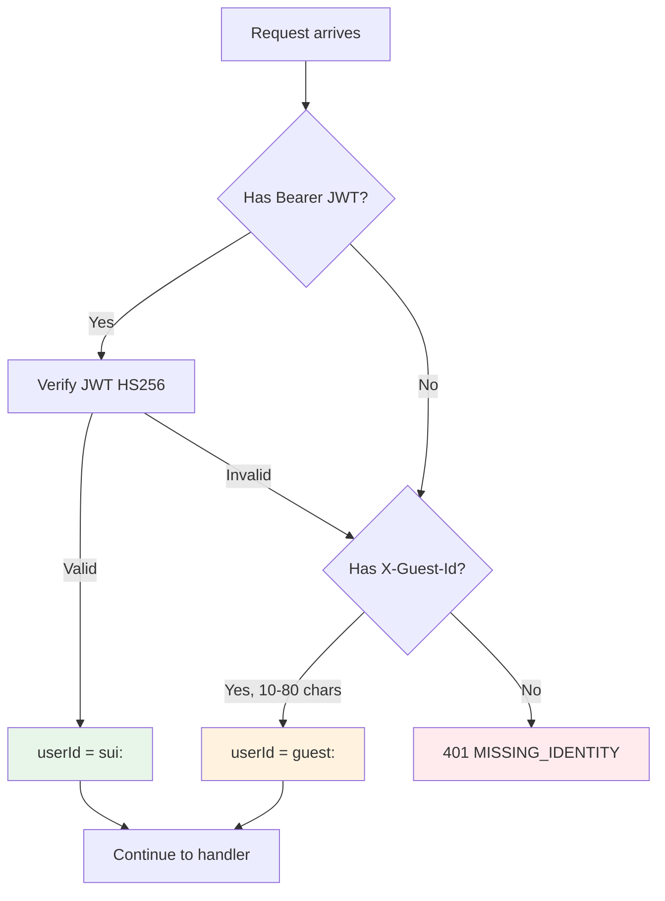

<!-- api.md | v1.0.0 | 2026-06-12 -->

# Moneyball — API Reference

Complete reference for all REST endpoints and Socket.io events.
Derived from source code as of v0.4.0.

---

## Table of Contents

1. [Authentication](#1-authentication)
2. [Public Endpoints](#2-public-endpoints)
3. [User Endpoints](#3-user-endpoints-require-identity)
4. [Admin Endpoints](#4-admin-endpoints-require-admin-jwt)
5. [Socket.io Events](#5-socketio-events)
6. [Error Handling](#6-error-handling)
7. [Identity Model](#7-identity-model)

---

## 1. Authentication

### POST `/api/auth/nonce`

Request a sign-in nonce. Returns a canonical [SIWS](https://docs.sui.io/concepts/sui-wallet-standard) message for the wallet to sign.

**Request body:**

```json
{
  "suiAddress": "0xabc123..."
}
```

**Response (200):**

```json
{
  "ok": true,
  "nonce": "a1b2c3d4-...",
  "issuedAt": "2026-06-12T10:00:00.000Z",
  "expiresAt": "2026-06-12T10:05:00.000Z",
  "message": "<domain> wants you to sign in with your Sui account:\n0xabc123...\n\nSign in to Moneyball Cabinet.\n\nURI: http://localhost:3000\nVersion: 1\nNonce: a1b2c3d4-...\nIssued At: ...\nExpiration Time: ..."
}
```

**Errors:**

| Status | Error | Cause |
|--------|-------|-------|
| 400 | `BAD_SUI_ADDRESS` | Address doesn't start with `0x` or is too short |

---

### POST `/api/auth/verify`

Verify the wallet signature and receive a JWT.

**Request body:**

```json
{
  "suiAddress": "0xabc123...",
  "nonce": "a1b2c3d4-...",
  "message": "<the canonical message from /nonce>",
  "signature": "<base64 Ed25519 signature>"
}
```

**Response (200):**

```json
{
  "ok": true,
  "token": "eyJhbGciOiJIUzI1NiIs...",
  "viewer": {
    "suiAddress": "0xabc123...",
    "role": "user",
    "exp": 1718276400
  }
}
```

`role` is `"admin"` if the address is in `ADMIN_ALLOWLIST`, otherwise `"user"`.

**Errors:**

| Status | Error | Cause |
|--------|-------|-------|
| 400 | `MISSING_FIELDS` | One or more required fields absent |
| 401 | `INVALID_NONCE` | Nonce not found |
| 401 | `NONCE_REPLAY` | Nonce already consumed |
| 401 | `NONCE_EXPIRED` | Nonce TTL exceeded (default 5 min) |
| 401 | `NONCE_ADDRESS_MISMATCH` | Address doesn't match the nonce's address |
| 401 | `MESSAGE_MISMATCH` | Signed message ≠ server's canonical message |
| 401 | `AUTH_FAILED` | Signature verification failed |

---

## 2. Public Endpoints

No authentication required.

### GET `/health`

**Response (200):**

```json
{ "ok": true, "ts": "2026-06-12T10:00:00.000Z" }
```

---

### GET `/api/public/matches`

Current match state from the MatchWorker's in-memory cache.

**Response (200):**

```json
{
  "ok": true,
  "live": [ /* matches with status "live" */ ],
  "upcoming": [ /* next 10 scheduled matches, sorted by kickoff */ ],
  "recent": [ /* last 10 finished matches, newest first */ ]
}
```

**Match shape:**

```typescript
{
  id: string           // "fd:498765" or "manual:m1"
  homeTeam: string
  awayTeam: string
  kickoffUtc: string   // ISO 8601
  stage: "group" | "knockout"
  status: "scheduled" | "live" | "finished"
  result: {            // null unless finished
    homeScore: number
    awayScore: number
    outcome: "1" | "X" | "2"
  } | null
}
```

---

### GET `/api/public/agents/:agentId/predictions`

Prediction history for an agent (up to 30, newest first). Outcomes are merged when available.

**Path params:** `agentId` — one of: `dr_morgan`, `scout_alvarez`, `viktor_kane`, `sofia_mendes`, `madame_pythia`

**Response (200):**

```json
{
  "ok": true,
  "agentId": "dr_morgan",
  "items": [
    {
      "schemaVersion": "1.0",
      "type": "prediction",
      "agentId": "dr_morgan",
      "createdAt": "2026-06-12T10:00:00.000Z",
      "matchId": "fd:498765",
      "pick": "1",
      "confidence": 0.72,
      "reasoning": "xG model: Brazil 0.58 vs Germany 0.49 ...",
      "predictionId": "pred:fd:498765:dr_morgan",
      "topic": "wc_group",
      "rawConfidence": 0.72,
      "paramsVersion": 1,
      "outcome": {
        "correct": true,
        "resolvedAt": "2026-06-12T20:00:00.000Z"
      }
    }
  ]
}
```

---

### GET `/api/public/agents/:agentId/evolution`

Evolution history for an agent (up to 30, newest first).

**Response (200):**

```json
{
  "ok": true,
  "agentId": "dr_morgan",
  "items": [
    {
      "schemaVersion": "1.0",
      "type": "evolution",
      "agentId": "dr_morgan",
      "createdAt": "2026-06-13T08:00:00.000Z",
      "summary": "Window n=25, Brier=0.215. calibration gap 0.081 → confidenceBias 0.000→-0.012.",
      "parameterDiff": { "confidenceBias": -0.012 },
      "runId": "run-abc-123",
      "fromVersion": 0,
      "toVersion": 1,
      "evolutionType": "param_update"
    }
  ]
}
```

---

### GET `/api/public/agents/:agentId/params`

Current `AgentParams` for an agent (public, for the Memory tab).

**Path params:** `agentId`

**Response (200):**

```json
{
  "ok": true,
  "params": {
    "agentId": "dr_morgan",
    "version": 2,
    "confidenceBias": -0.012,
    "hedgingLevel": 0.3,
    "topicCalibration": {
      "wc_group": { "multiplier": 0.95, "sampleSize": 20 }
    },
    "updatedAt": "2026-06-13T08:00:00.000Z",
    "sourceEvolutionEventId": "evt-xyz-456"
  }
}
```

**Errors:**

| Status | Error | Cause |
|--------|-------|-------|
| 404 | `UNKNOWN_AGENT` | `agentId` not in the configured agent list |

---

## 3. User Endpoints (require identity)

All routes under `/api` (except auth and public) pass through `optionalJwt` middleware.
Identity is resolved as:
1. JWT Bearer token → `sui:<address>` (kind: `sui`)
2. `X-Guest-Id` header → `guest:<guestId>` (kind: `guest`)
3. Neither → 401

---

### GET `/api/me/summary`

User's interaction summary (disagree counts, takeaways).

**Headers:** `Authorization: Bearer <jwt>` or `X-Guest-Id: <uuid>`

**Response (200):**

```json
{
  "ok": true,
  "summary": {
    "schemaVersion": "1.0",
    "guestId": "guest:abc-123",
    "updatedAt": "2026-06-12T15:00:00.000Z",
    "sessionsCount": 1,
    "agentDisagreeCounts": { "dr_morgan": 2, "scout_alvarez": 1 },
    "lastAgentId": "scout_alvarez",
    "takeaways": ["You disagreed with dr_morgan for the first time.", "Day 1: no strong opinions yet."]
  },
  "meta": { "storage": "memwal", "identity": "guest" }
}
```

---

### POST `/api/me/disagree`

Record a disagree with an agent. Updates user summary + takeaways.

**Request body:**

```json
{ "agentId": "dr_morgan" }
```

**Response (200):** Same shape as GET `/api/me/summary`.

**Errors:**

| Status | Error | Cause |
|--------|-------|-------|
| 400 | `MISSING_AGENT_ID` | `agentId` not provided |
| 401 | `MISSING_IDENTITY` | No JWT or Guest-Id |

---

### POST `/api/roast`

Get a deterministic roast from an agent based on disagree history.

**Request body:**

```json
{ "agentId": "dr_morgan" }
```

**Response (200):**

```json
{
  "ok": true,
  "text": "I remember you argued with me (2x). That's… predictable.",
  "meta": { "disagree": 2, "storage": "memwal", "identity": "guest" }
}
```

---

## 4. Admin Endpoints (require admin JWT)

All admin endpoints pass through `requireAdmin` middleware.
Admin = JWT role `"admin"` OR address in `ADMIN_ALLOWLIST`.

---

### POST `/api/admin/agents/:agentId/predict`

Manually create a prediction event (demo/testing).

**Request body:**

```json
{
  "matchId": "WC26:demo-match",
  "pick": "Brazil win",
  "confidence": 0.75,
  "reasoning": "Demo prediction for testing."
}
```

**Response (200):**

```json
{ "ok": true, "ev": { /* AgentPredictionEvent */ } }
```

---

### POST `/api/admin/agents/:agentId/evolve`

Manually create an evolution event.

**Request body:**

```json
{
  "summary": "Adjusted methodology after poor calibration.",
  "parameterDiff": { "confidenceBias": -0.05 }
}
```

**Response (200):**

```json
{ "ok": true, "ev": { /* AgentEvolutionEvent */ } }
```

---

### POST `/api/admin/matches`

Create a manual match (used with ManualMatchProvider as fallback/demo).

**Request body:**

```json
{
  "homeTeam": "Brazil",
  "awayTeam": "Germany",
  "stage": "group",
  "kickoffUtc": "2026-06-15T18:00:00Z"
}
```

**Response (200):**

```json
{
  "ok": true,
  "match": {
    "id": "manual:m1",
    "homeTeam": "Brazil",
    "awayTeam": "Germany",
    "kickoffUtc": "2026-06-15T18:00:00Z",
    "stage": "group",
    "status": "scheduled",
    "result": null
  }
}
```

**Side effect:** Immediately triggers a `tick()` on the MatchWorker (agents predict if within lead window).

**Errors:**

| Status | Error | Cause |
|--------|-------|-------|
| 400 | `MANUAL_PROVIDER_DISABLED` | ManualMatchProvider not configured |
| 400 | `MISSING_TEAMS` | homeTeam or awayTeam empty |

---

### POST `/api/admin/matches/:id/resolve`

Resolve a manual match with a final score.

**Request body:**

```json
{
  "homeScore": 2,
  "awayScore": 1
}
```

**Response (200):**

```json
{
  "ok": true,
  "match": {
    "id": "manual:m1",
    "status": "finished",
    "result": { "homeScore": 2, "awayScore": 1, "outcome": "1" }
  }
}
```

**Side effect:** Triggers `tick()` → outcomes resolved → sleep pipeline potentially runs.

**Errors:**

| Status | Error | Cause |
|--------|-------|-------|
| 400 | `BAD_SCORE` | Non-integer or negative score |
| 404 | `UNKNOWN_MATCH` | Match ID not found |

---

### POST `/api/admin/agents/:agentId/sleep`

Force-trigger the sleep pipeline for an agent.

**Response (200):**

```json
{
  "ok": true,
  "result": {
    "kind": "evolved",
    "runId": "...",
    "fromVersion": 0,
    "toVersion": 1
  }
}
```

Possible `kind` values: `"evolved"`, `"rolled_back"`, `"noop"`, `"skipped"`, `"aborted"`.

---

### POST `/api/admin/simulate/day-plus-one`

Simulate a day's interaction (records a disagree for the identified user).

**Request body:**

```json
{ "agentId": "dr_morgan" }
```

**Response (200):** Same shape as `/api/me/summary`.

---

## 5. Socket.io Events

Connection: `io(backendUrl, { path: '/socket.io', transports: ['polling', 'websocket'] })`

### Client → Server (C2S)

#### `world:join`

Join the shared world. Sent on connect and on auth token change.

**Payload:**

```typescript
{
  worldId?: "main"       // default "main"
  token?: string         // JWT (optional)
  clientMeta?: {
    version?: string
    platform?: string
  }
}
```

**Ack callback:**

```typescript
{
  ok: boolean
  worldId: "main"
  serverTime: string     // ISO 8601
  viewer?: {
    suiAddress?: string
    role?: "user" | "admin" | "guest"
  }
}
```

**Side effect:** Server immediately emits `world:state` with current state.

---

### Server → Client (S2C)

#### `world:state`

Full world state snapshot. Emitted on join and periodically during ticks.

**Payload:**

```typescript
{
  worldId: "main"
  tick: number
  serverTime: string           // ISO 8601
  connectedClients: number
  agents: [
    {
      agentId: string          // e.g. "dr_morgan"
      name: string             // e.g. "Dr. Morgan"
      role: string             // e.g. "Statistician"
      status: "idle" | "thinking" | "acting" | "busy"
      position: { x: number, y: number }
      lastThought?: string
      lastActionAt?: string
    }
  ]
}
```

---

#### `agent:thought`

An agent's thought bubble. Broadcast to all clients in the world room. Rate-limited to 1 per 1.5s per agent.

**Payload:**

```typescript
{
  worldId: "main"
  tick: number
  serverTime: string
  agentId: string
  text: string
  ttlMs: number              // default 2500ms
}
```

---

#### `error`

Server-side error notification.

**Payload:**

```typescript
{
  code: string
  message: string
  details?: unknown
}
```

---

## 6. Error Handling

All REST endpoints return JSON with `{ ok: false, error: "ERROR_CODE" }` on failure.

| HTTP Status | Meaning |
|-------------|---------|
| 400 | Bad request (missing/invalid fields) |
| 401 | Unauthorized (no identity or auth failed) |
| 403 | Forbidden (not admin) |
| 404 | Resource not found |

The `optionalJwt` middleware silently ignores invalid tokens (guest fallback).
The `requireAdmin` middleware returns 401/403.

---

## 7. Identity Model



**Agent IDs:** `dr_morgan`, `scout_alvarez`, `viktor_kane`, `sofia_mendes`, `madame_pythia`

**Methodology types:** `weighted_metrics`, `narrative_sentiment`, `contrarian_inversion`, `expected_value`, `deterministic_mysticism`
