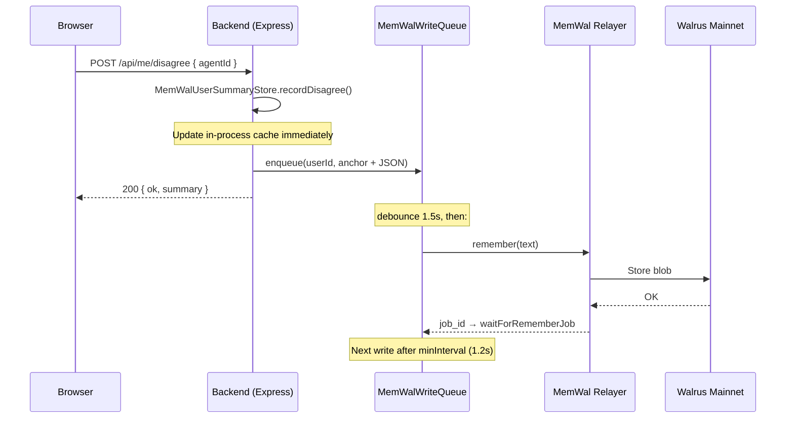
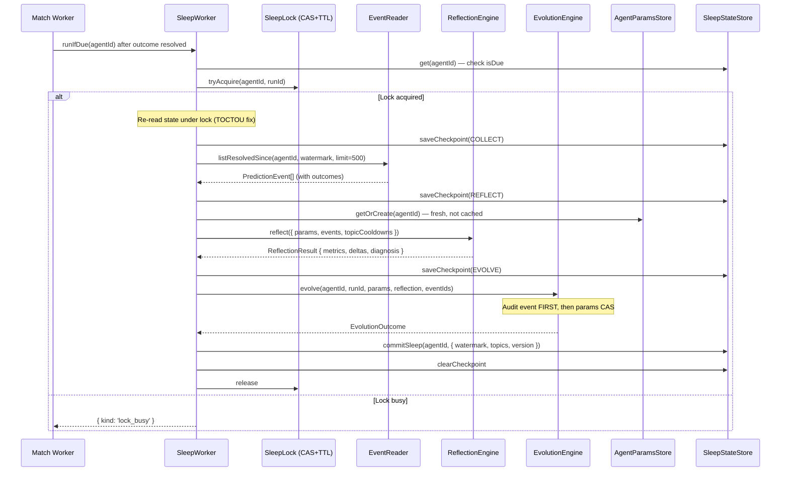

<!-- memory-design.md | v1.0.0 | 2026-06-12 -->

# Moneyball — Memory Architecture

> How five AI agents remember, learn and evolve on Walrus mainnet.

---

## Table of Contents

1. [Memory Model — What Gets Stored](#1-memory-model)
2. [Write Path — Queue, Throttle, Durability](#2-write-path)
3. [Read Path — Rehydration & Caching](#3-read-path)
4. [Sleep / Evolution Cycle](#4-sleep--evolution-cycle)
5. [Walrus / MemWal Mainnet Specifics](#5-walrus--memwal-mainnet-specifics)
6. [MVP Scope vs V2 / V3](#6-mvp-scope-vs-v2--v3)

---

## 1. Memory Model

Moneyball persists three categories of data. Every write targets
[MemWal](https://github.com/mysten-incubation/memwal) (Walrus Memory relayer)
as the single durable store; the backend process holds authoritative in-process
state and mirrors every mutation to MemWal for judge-visible, append-only
permanence.

### 1a. Agent Parameters (`AgentParams`)

The **only mutable surface** of an agent. Mutations happen exclusively through
`EvolutionEngine` (single writer).

```typescript
// sleep-worker/src/params/AgentParams.ts
interface AgentParams {
  agentId: string;
  version: number;              // monotonically increasing
  confidenceBias: number;       // additive correction to raw confidence
  hedgingLevel: number;         // how much the agent hedges (prompt input)
  topicCalibration: Record<TopicId, {
    multiplier: number;         // per-topic confidence multiplier
    sampleSize: number;
  }>;
  updatedAt: string;
  sourceEvolutionEventId: string | null;
}
```

Hard bounds enforced by both `ReflectionEngine` and `EvolutionEngine`
(defense in depth):

| Parameter | Min | Max |
|-----------|-----|-----|
| `confidenceBias` | −0.3 | +0.3 |
| `hedgingLevel` | 0 | 1 |
| `topicMultiplier` | 0.5 | 1.5 |
| `effectiveConfidence` | 0.01 | 0.99 |

> Source: `PARAM_BOUNDS` in `sleep-worker/src/params/AgentParams.ts`

**MemWal key layout** (`sleep-worker/src/memory/keys.ts`):

| Key pattern | Purpose | Writer |
|-------------|---------|--------|
| `agent/{id}/personality` | Current params (live pointer) | Sleep pipeline |
| `agent/{id}/personality_history/{v}` | Last 10 versions (rollback) | Sleep pipeline |
| `agent/{id}/sys/sleep_state` | Watermark, cooldowns | Sleep pipeline |
| `agent/{id}/sys/resolved_counter` | Monotonic outcome counter | Interaction path |
| `agent/{id}/sys/sleep_lock` | CAS + TTL distributed lock | Sleep pipeline |
| `agent/{id}/sys/sleep_checkpoint` | Crash-recovery state | Sleep pipeline |

### 1b. Agent Events (Predictions, Outcomes, Evolution)

Stored through `AgentEventService` (`apps/backend/src/agents/agentEventService.ts`)
with per-agent MemWal namespaces (`mwc-agent:{agentId}`). Three event types:

```typescript
// apps/backend/src/agents/agentEventService.ts
type AgentPredictionEvent = {
  schemaVersion: '1.0'; type: 'prediction';
  agentId: string; createdAt: string;
  matchId: string; pick: string; confidence: number; reasoning: string;
  predictionId?: string; topic?: string;
  rawConfidence?: number; paramsVersion?: number;
  outcome?: { correct: boolean; resolvedAt: string };  // merged on read
}

type AgentOutcomeEvent = {
  schemaVersion: '1.0'; type: 'outcome';
  agentId: string; createdAt: string;
  predictionId: string; correct: boolean; resolvedAt: string;
}

type AgentEvolutionEvent = {
  schemaVersion: '1.0'; type: 'evolution';
  agentId: string; createdAt: string;
  summary: string; parameterDiff?: Record<string, number>;
  runId?: string; fromVersion?: number; toVersion?: number;
  evolutionType?: string;
}
```

Each event is stored in MemWal with a semantic anchor:
`moneyball:agent_event type={prediction|outcome|evolution} agentId={id}`.

The sleep-worker's internal event log uses richer types
(`sleep-worker/src/events/types.ts`) with fields like `rawConfidence`,
`effectiveConfidence`, `paramsVersion`, and a composite `ResolvedCursor`
(`resolvedAt` + `eventId`). `BackendEventReader`
(`apps/backend/src/agents/sleepAdapters.ts`) mirrors every event to both the
in-process log and `AgentEventService` (public endpoints + MemWal).

### 1c. User Summaries

Per-user interaction profile stored on MemWal. Recalled on connect; updated on
each disagree.

```typescript
// apps/backend/src/memory/userSummaryStore.ts
interface UserSummary {
  schemaVersion: '1.0';
  guestId: string;            // "sui:0x..." or "guest:uuid"
  updatedAt: string;
  sessionsCount: number;
  agentDisagreeCounts: Record<string, number>;
  lastAgentId?: string;
  takeaways: string[];        // capped at 12 entries
}
```

MemWal anchor: `moneyball:user_summary userId={userId}`.

Takeaways are deterministic milestones (1st disagree, 3rd = "pattern detected",
5th = "bias locked in") — no LLM involved.

---

## 2. Write Path

All MemWal writes flow through `MemWalWriteQueue`
(`apps/backend/src/memory/memwalWriteQueue.ts`), a coalescing, throttled write
queue designed to handle the relayer's 429 rate limits.

### Queue Mechanics

```
                         enqueue(key, text)
                              │
                   ┌──────────▼──────────┐
                   │  pendingByKey (Map)  │  ← same key overwrites (coalescing)
                   └──────────┬──────────┘
                              │ kick() → loop()
                         ┌────▼────┐
                         │ debounce │ (1.2–1.5s after enqueue)
                         └────┬────┘
                         ┌────▼──────────┐
                         │ minInterval?  │ (1.2–1.5s since last write)
                         └────┬──────────┘
                              │ remember(text)
                         ┌────▼──────────────┐
                         │ MemWal relayer     │
                         │ (Walrus mainnet)   │
                         └────┬──────────────┘
                         OK?──┤
                        ╱     ╲
                      yes      no (429/error)
                       │       │
                    delete   retry with backoff
                    from       ├── retry_after_seconds from response
                    pending    └── or exponential: 2^attempts (max 60s)
```

**Sequence diagram — disagree flow (user → MemWal):**



### Write Queue Instances

The backend creates three separate queue instances:

| Queue | Location | `debounceMs` | `minIntervalMs` |
|-------|----------|-------------|-----------------|
| User summaries | `MemWalUserSummaryStore` | 1500 | 1200 |
| Agent events | `AgentEventService` (per agent) | 1200 | 1200 |
| System KV (params, locks, state) | `KvMemWalClient` | 1500 | 1500 |

### Key Write Ordering Invariants

1. **History before pointer** — `AgentParamsStore.commitNewVersion` writes the
   versioned snapshot to `personality_history/{v}` before updating the
   `personality` live pointer. A crash between the two writes preserves the
   referenced version.

2. **Audit before mutation** — `EvolutionEngine` appends the `EvolutionEvent`
   (audit log) before touching `AgentParams`. An event without a params change
   is recoverable; a params change without an event is unauditable corruption.

3. **Single writer per key** — `sleep_state` is written only by the sleep
   pipeline; `resolved_counter` only by the interaction path. This eliminates
   non-CAS read-modify-write races.

---

## 3. Read Path

### 3a. Agent Params (Inference)

```
AgentParamsStore.getCached(agentId)
  │
  ├── Cache hit (< 30s old) → return cached AgentParams
  │
  └── Cache miss → KvMemWalClient.read(agent/{id}/personality)
                    │
                    └── In-process Map lookup (authoritative)
                        │
                        ├── Found → return value
                        └── Not found → return default params (v0, bias=0, hedging=0.3)
```

The 30s cache TTL is intentional: during inference, stale params for ≤30s are
acceptable. The sleep pipeline always calls `getOrCreate` (bypasses cache) to
get fresh params before CAS writes.

### 3b. User Summaries (Auth / Connect)

```
GET /api/me/summary
  │
  ├── Identify user (JWT → sui:{address} | X-Guest-Id → guest:{uuid})
  │
  └── MemWalUserSummaryStore.getOrCreate(userId)
        │
        ├── Cache hit (< 30s) → return cached
        │
        └── Cache miss → memwal.recall(anchor)
              │
              ├── Results found → pick latest by updatedAt → cache + return
              │
              └── Empty / error → create fresh summary → cache + enqueue write
```

`recall` is MemWal's semantic search — the anchor string
`moneyball:user_summary userId={id}` retrieves all stored versions, and the
code picks the most recent by `updatedAt`. On relayer failure, a fresh summary
is returned (graceful degradation; the server never crashes on MemWal errors).

### 3c. Agent Events (Public API)

`GET /api/public/agents/:agentId/predictions` calls
`AgentEventService.listPredictions`, which:

1. Recalls prediction events via `memwal.recall(anchor)`.
2. Recalls outcome events separately.
3. Merges outcomes into predictions by `predictionId`.
4. Returns up to 20 items, newest first.

When `MEMWAL_KEY` is absent (local dev), events are served from an in-process
array (`localLog`).

---

## 4. Sleep / Evolution Cycle

The sleep cycle is how agents *learn from outcomes*. It is **fully
deterministic and LLM-free** — pure arithmetic over resolved predictions.

### 4a. Trigger

`SleepWorker.runIfDue(agentId)` checks two conditions:

| Trigger | Threshold (configurable) |
|---------|-------------------------|
| Count-based | `resolvedSinceSleep ≥ SLEEP_MIN_RESOLVED` (default 3 for hackathon) |
| Time-based | `minutesSince ≥ maxHours × 60` AND `resolvedSinceSleep ≥ 1` |
| Hard floor | `minutesSince < SLEEP_MIN_MINUTES` → skip (default 30 min) |

> Source: `SleepWorker.isDue()` in `sleep-worker/src/sleep/SleepWorker.ts`

### 4b. Pipeline Phases



### 4c. Reflection (Pure Arithmetic)

`ReflectionEngine.reflect()` (`sleep-worker/src/reflection/ReflectionEngine.ts`)
computes `ReflectionMetrics` from the resolved-event window, then proposes
clamped `ParamDelta[]`:

**Metrics computed** (`sleep-worker/src/reflection/metrics.ts`):

| Metric | Formula | Purpose |
|--------|---------|---------|
| `brierOverall` | mean of `(effectiveConfidence − outcome)²` | Overall accuracy |
| `calibrationGap` | n-weighted mean of `(meanPredicted − hitRate)` per bucket | Over/underconfidence |
| `byTopic[t].brier` | Per-topic Brier score | Topic-specific accuracy |
| `disagreeRateOverall` | Disagree count / events (per-user capped at 20%) | User pushback signal |
| `byParamsVersion[v].brier` | Brier grouped by params version | Shadow evaluation for rollback |

Calibration buckets: `[0, 0.2), [0.2, 0.4), [0.4, 0.6), [0.6, 0.8), [0.8, 1.0]`.

**Signal separation (invariant):**

| Signal | Adjusts | Never touches |
|--------|---------|---------------|
| Outcomes (calibration gap) | `confidenceBias` | `hedgingLevel` |
| Outcomes (topic excess) | `topicCalibration[t].multiplier` | `hedgingLevel` |
| User disagrees | `hedgingLevel` | calibration params |

**Delta budget:** total `|delta|` per sleep is capped at `maxTotalDelta = 0.1`.
Highest-impact deltas are kept first. Topics have a 2-sleep cooldown after
adjustment.

**Shadow evaluation / rollback:** if `brierOverall` under the current params
version exceeds the previous version's Brier by > 0.05 (with ≥ 15 samples on
both), `ReflectionEngine` recommends rollback. The evolution engine re-commits
a historical snapshot as version N+1 (the version number always moves forward).

### 4d. Evolution (Single Writer)

`EvolutionEngine` (`sleep-worker/src/evolution/EvolutionEngine.ts`) is the
**only** component that may mutate `AgentParams`. It:

1. Checks idempotency via `getEvolutionEventForRun` — a duplicate `runId`
   either finishes a half-applied write (crash recovery) or skips.
2. Re-validates all deltas against hard bounds (defense in depth).
3. Appends the `EvolutionEvent` to the event log (audit-first).
4. Calls `AgentParamsStore.commitNewVersion` with CAS.

**LLM never mutates numbers.** The entire pipeline is deterministic: given the
same event window and current params, the same deltas are produced every time.
Template-based text rendering (`renderDiagnosis`) produces human-readable
summaries without any LLM call.

### 4e. Crash Safety

| Failure point | Recovery |
|---------------|----------|
| Between lock acquire and checkpoint | Lock TTL expires; next `runIfDue` re-enters |
| Between audit event and params write | Idempotent redo: `EvolutionEngine` detects `fromVersion === live version` and finishes the apply |
| Between params write and sleep commit | State checkpoint records `completedPhase: 'EVOLVE'`; next run detects stale watermark |
| Lock holder dies | TTL-based expired-lock steal via CAS |

---

## 5. Walrus / MemWal Mainnet Specifics

### Integration Point

All communication with Walrus goes through
[MemWal](https://github.com/mysten-incubation/memwal) — the official
Walrus Memory SDK. The backend never calls Walrus storage APIs directly.

```
Backend Node.js process
  └── @mysten-incubation/memwal (npm package)
        ├── remember(text) → POST to relayer → Walrus blob
        ├── recall(anchor) → semantic retrieval from Walrus
        ├── health() → relayer connectivity check
        └── waitForRememberJob(jobId) → poll until durable
```

### Configuration

| Env var | Value (prod) | Source |
|---------|-------------|--------|
| `MEMWAL_RELAYER` | `https://relayer.memory.walrus.xyz` | MemWal mainnet relayer |
| `MEMWAL_KEY` | API key from memory.walrus.xyz | Account-specific |
| `MEMWAL_ACCOUNT_ID` | Account ID | Account-specific |
| `MEMWAL_NAMESPACE` | `moneyball` | App-level isolation |

> Source: `apps/backend/.env.example`

### Namespace Layout

| MemWal namespace | Content |
|------------------|---------|
| `moneyball` | User summaries (`MemWalUserSummaryStore`) |
| `moneyball:sys` | System KV — params, sleep state, locks (`KvMemWalClient`) |
| `mwc-agent:{agentId}` | Per-agent events — predictions, outcomes, evolution (`AgentEventService`) |

### Object Layout: KvMemWalClient

MemWal's native API is `remember(text)` / `recall(anchor)` — append-only
semantic storage, not key-value. `KvMemWalClient`
(`apps/backend/src/agents/sleepAdapters.ts`) bridges this gap:

- **Authoritative state:** in-process `Map<string, { value, memwalVersion, seq }>`
  — single backend instance = single writer, so CAS on the Map is sound.
- **Durable mirror:** every accepted write is enqueued to MemWal with anchor
  `moneyball:sys_kv key={key} seq={seq}` followed by JSON payload.
- **Restart hydration:** best-effort `recall` for known key prefixes.
  Worst case: agents resume from default params; the full evolution history
  is still readable in MemWal.

> This matches decision D4: "latest pointers off-chain, durable record in MemWal."

### Cost Model

MemWal writes go through the relayer to Walrus mainnet blob storage. Each
`remember()` call creates one blob. With coalescing queues and the hackathon
pace (~4 matches/day, 5 agents), expected write volume is:

- ~5 prediction events + ~5 outcome events per match ≈ 40/day
- ~1 evolution event per agent per sleep ≈ 5/day
- User summary updates ≈ proportional to active users

All within MemWal's free/hackathon tier limits.

---

## 6. MVP Scope vs V2 / V3

### Why No Embeddings / LLM-Memory in MVP

The hackathon's #1 criterion is **Memory Depth & Authenticity** — visible
behavioural change from day 1 to day 4+. The current architecture achieves
this with:

- **Deterministic, auditable evolution**: every parameter change traces to
  specific events with computed metrics. Judges can verify the chain.
- **Zero LLM cost**: no API keys, no latency, no hallucinated parameters.
- **Reproducibility**: given the same event window, the same evolution is
  produced — critical for trust in a hackathon demo.

Embeddings and LLM-driven memory are deliberately out of scope: they add
cost, latency, and non-determinism without improving the "before/after"
story judges evaluate.

### V2 / V3 Roadmap

| Feature | Version | Notes |
|---------|---------|-------|
| Quilt KV manifest | V2 | Replace in-process Map with Quilt-backed KV on Walrus; eliminates hydration risk on restart |
| Multi-instance backend | V2 | Requires moving from in-process Map to distributed KV; SleepLock already supports this |
| LLM-voiced evolution summaries | V2 | LLM writes prose *after* deterministic params are committed; numbers stay LLM-free |
| Embedding-based user memory | V3 | Semantic recall of user interaction patterns (beyond disagree counts) |
| Seal encryption for user data | V3 | Per-user encrypted summaries on Walrus (privacy upgrade) |
| Sui dynamic fields for latest pointers | V3 | Move off-chain pointers on-chain; full decentralisation |
